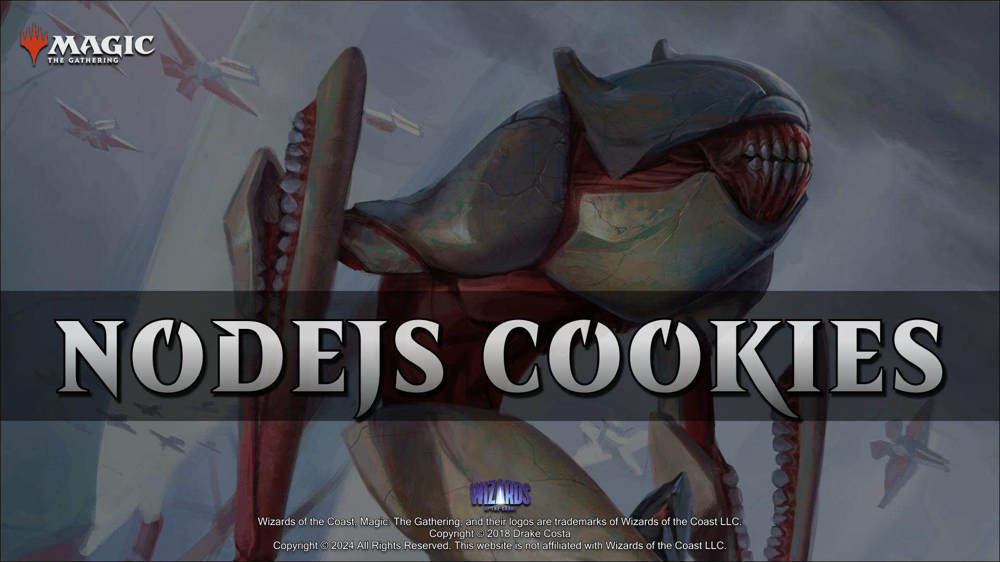
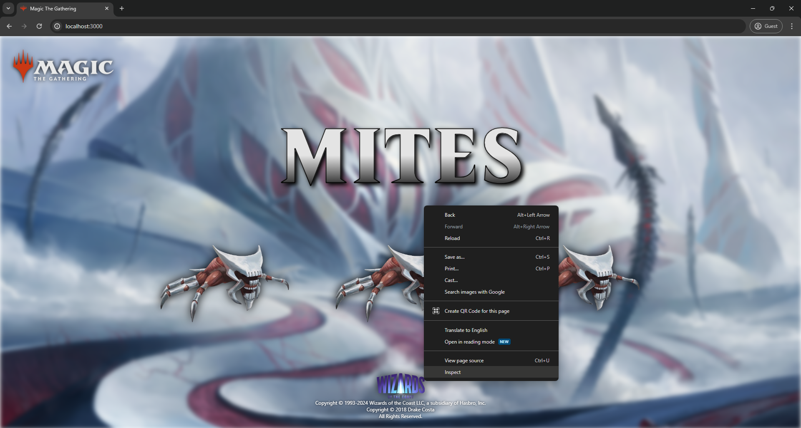
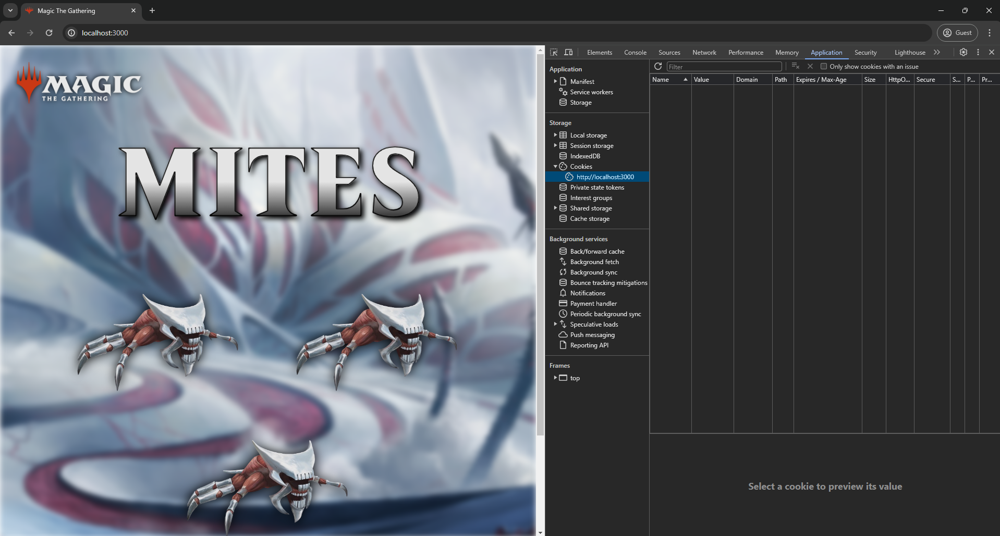
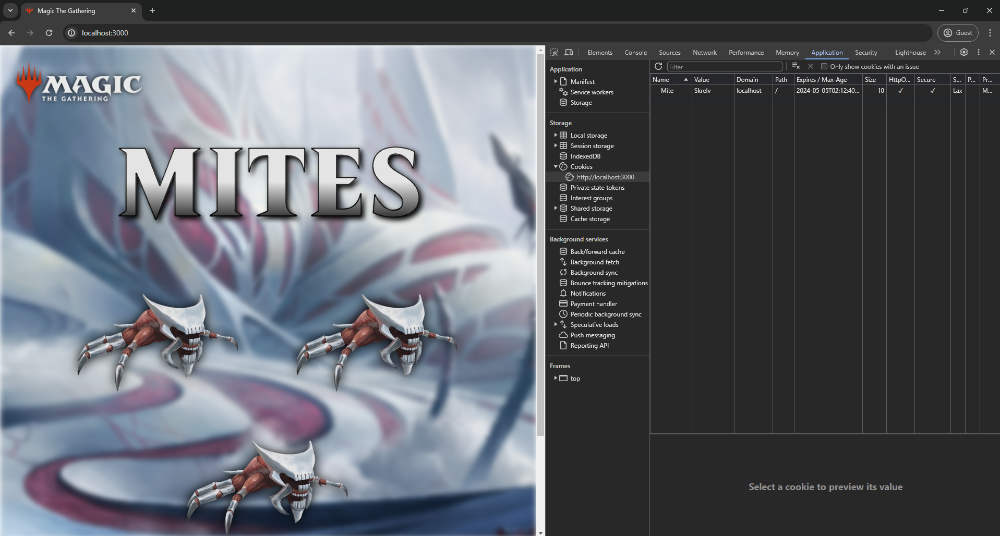
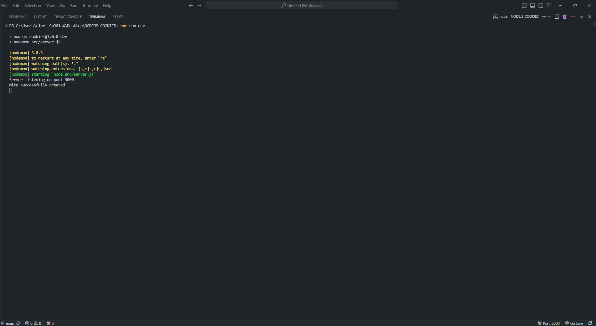
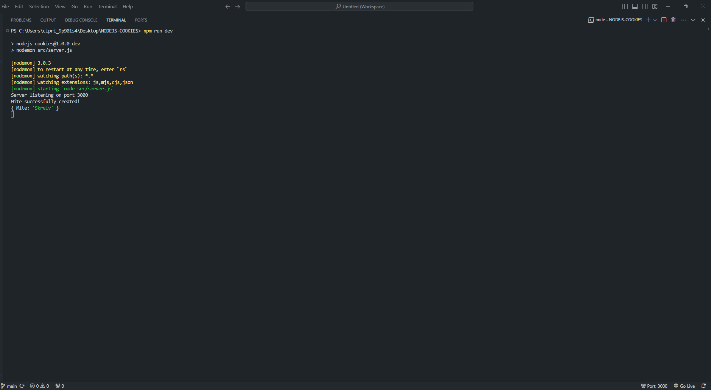
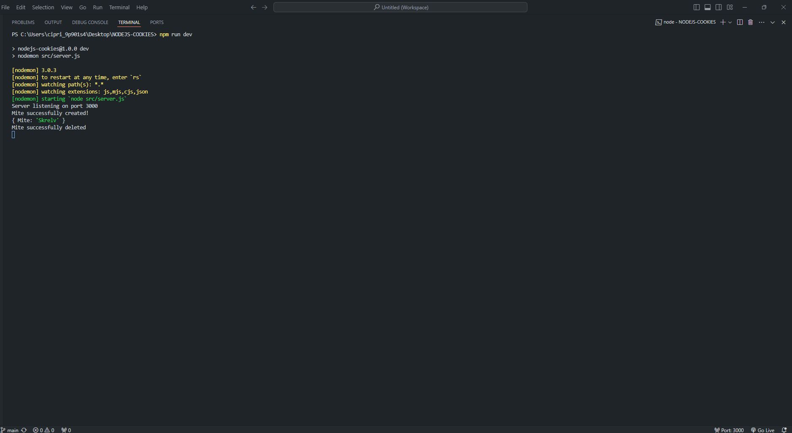

# NODEJS-COOKIES



## INTRODUCTION

In this project we will learn how to create cookies through our **Node.js** server using **Express.js** framework and the npm library called "cookie-parser", which allows us to manage cookies in a simple way through simple JavaScript functions.
Cookies are not related to a specific framework, so you can use any other **Node.js** backend framework.

## TECHNOLOGIES

- Node.js
- Express.js

## INSTALLATION

1. Install the recommended version for most users of **Node.js** from the following link.

https://nodejs.org/en

2. Use the **npm** package manager to install.
3. Execute the command from the terminal located at ./NODEJS-COOKIES.

```shell
npm i
```

## EXECUTION

4. Use the **npm** package manager to run.
5. Execute the command from the terminal located at ./NODEJS-COOKIES.

```shell
npm run dev
```

6. Open the software in your local browser and right-click to select the "Inspect" option.

<br />



<br />

7. Go to "Application" => "Cookies".

<br />



<br />

8. Click on the first skrelv. Congratulations! you have created your first mite cookie!

<br />



<br />

9. You can also verify the message by console.

<br />



<br />

10. Click on the second skrelv to see your mite cookie by console.

<br />



<br />

11. Click on the third skrelv to delete your mite cookie.

<br />


<br />

12. You can also verify the message by console.

<br />



<br />

13. By clicking again on the second and third skrelv we will corroborate by console that no mite cookies were found. <br /> Keep in mind that the mite cookie has an expiration time of 10 seconds so, after executing the previous step after this time after having created the mite cookie, it will show the same messages.

<br />


## LICENSE

All fonts are copyright of [Wizards of the Coast](http://magicthegathering.com).

CSS released under the [MIT license](https://github.com/Saeris/typeface-beleren-bold/blob/master/LICENSE.md).
